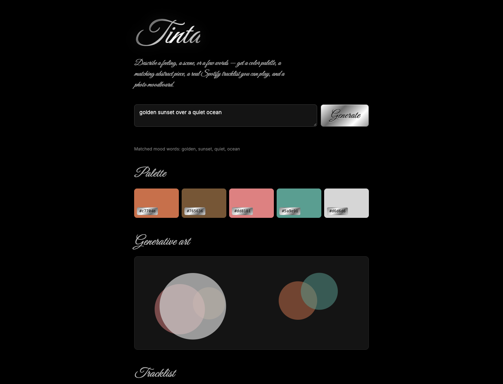

<div align="center">

# Tinta

**Color palettes, playlists, and images to match your special mood.**

[](https://github.com/tttamannaanand/Tinta/actions/workflows/ci.yml)
[](LICENSE)




</div>

## What this does

*Tinta* — Spanish/Italian for "ink" or "tint." Type a mood, get the color it's dyed in.

Describe a feeling, a scene, or a few words and get back four things pulled from the same palette:

| Output | How |
|---|---|
| **Palette** | 5 tonal colors generated from the words in your input |
| **Generative art** | An abstract piece rendered in that exact palette |
| **Tracklist** | A real, playable Spotify tracklist matched to the mood |
| **Moodboard** | A grid of photos from Unsplash matched to the mood |

There's no machine-learning sentiment model here — the "understanding" is a hand-curated lexicon (`site/js/lexicon.js`) mapping ~90 common mood/imagery words (*golden*, *rain*, *melancholy*, *neon*...) to a color anchor and a music genre. Same input text always produces the same output — it's a seeded hash, not randomness, so a mood you liked is reproducible.

## How it works

- **Palette** — matched words' HSL color anchors are blended with a saturation-weighted circular mean into 5 tonal colors. If the words pull in opposite directions (*golden* + *ocean*), Tinta keeps the most vivid word's hue instead of averaging to a green nobody asked for
- **Generative art** — abstract SVG circles, seeded from the input text, colored from the palette
- **Tracklist** — matched words' genre tags become a Spotify search query, results come back as embedded playable widgets
- **Moodboard** — matched words become an Unsplash search query, results are shown with required photographer credit

## Architecture

```
browser (site/)                         Vercel Functions (api/)
 ├─ lexicon.js  words → HSL + genre      ├─ spotify-search.js   client-credentials token, track search
 ├─ palette.js  render swatches/art  ──► └─ unsplash-search.js  key stays server-side
 └─ no keys, no secrets in the page
```

## Two things worth knowing

**Spotify:** their `/recommendations` and `/audio-features` endpoints — the ones that would've let this match songs by actual mood *audio* data — were deprecated for new developer apps in November 2024. On top of that, Spotify overhauled Developer Mode again in February–March 2026: the app owner's account now needs an active Premium subscription, and apps are capped at one Client ID per developer. This project works around it by mapping mood keywords to genre search terms instead of audio features, and doing a plain track search.

**Why there's a serverless function:** Spotify's search requires a client-credentials token exchange, which needs a secret that can never sit in frontend JS. `api/spotify-search.js` does that exchange server-side and only ever returns track results to the browser. The Unsplash key goes through `api/unsplash-search.js` the same way, so no key ever ships in the page.

## Setup

```bash
git clone https://github.com/tttamannaanand/tinta.git
cd tinta
npm install -g vercel   # if you don't have it

cp .env.example .env
# fill in SPOTIFY_CLIENT_ID, SPOTIFY_CLIENT_SECRET and UNSPLASH_ACCESS_KEY
# Spotify: https://developer.spotify.com/dashboard (owner needs Premium since 2026)
# Unsplash: https://unsplash.com/developers (the Access Key, not the Secret Key)
```

```bash
vercel dev
# → open http://localhost:3000
```

Plain `python3 -m http.server` inside `site/` will *not* work for the Spotify tracklist — that needs the `/api` route, which only `vercel dev` or a real Vercel deployment provides. The palette and art still work fine as pure static files.

## Deploying

Import this repo on [Vercel](https://vercel.com), then in the project's **Settings → Environment Variables** add `SPOTIFY_CLIENT_ID`, `SPOTIFY_CLIENT_SECRET` and `UNSPLASH_ACCESS_KEY`. Deploy — `vercel.json` points static output at `site/`, and Vercel auto-detects `api/spotify-search.js` as a serverless function.

**Never commit your `.env` file** — `.gitignore` already excludes it.

## Development

```bash
npm install
npm test              # lexicon, palette maths and API proxy tests (node:test)
npm run lint && npm run format:check
```

CI runs the same checks on every push and pull request.

## Stack

Plain HTML/CSS/JS on the frontend, no framework. One Vercel serverless function for the Spotify token exchange. No database — nothing persists, every generation is stateless.

## Extending this

- The lexicon is deliberately small and easy to read — add your own words/anchors to `MOOD_LEXICON` in `site/js/lexicon.js`
- Swap the circle-based generative art for something fancier (noise fields, gradients-as-shapes) in `renderArt()` in `site/js/palette.js`
- Add a "save this mood" feature using `localStorage`, or build a personal mood history

## Credit

Track playback via [Spotify](https://open.spotify.com)'s embed player. Photos via [Unsplash](https://unsplash.com), credited per-image as their API terms require.

## License

[MIT](LICENSE)
